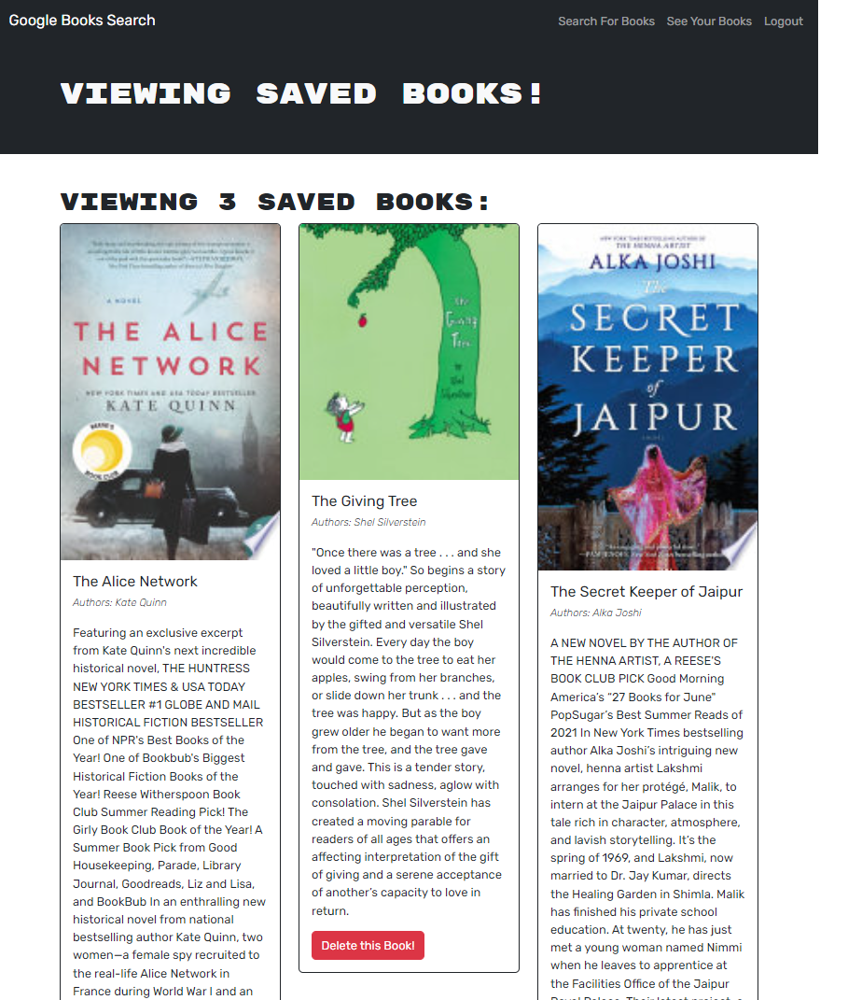

# I love books!

## Description

This app is a MERN stack app that uses Google Books API search engine to search for books and save them to a database. It was built with a RESTful API and was refactored to a GraphQL API with Apollo Server, then deployed to Heroku. 

## Table of Contents

- [Installation](#installation)
- [Usage](#usage)
- [Tests](#tests)
- [License](#license)
- [Screenshot](#screenshot)
- [Deployed Application](#deployed-application)

## Installation

To install this application, run `npm i` to install the necessary dependencies.

## Usage

To use this application, run `npm build` and `npm run develop` to start the server.

## Tests

Apollo Sandbox was used to test the GraphQL API.

## License

## Screenshot

## Deployed Application

https://salty-mountain-70469.herokuapp.com/